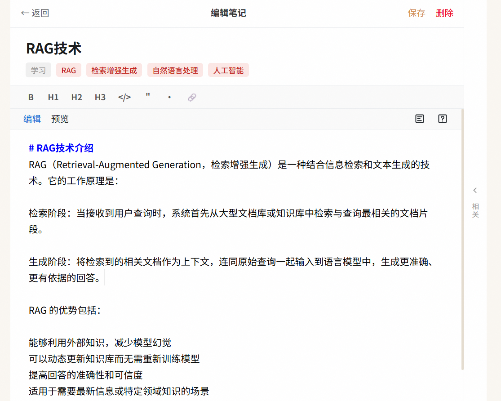
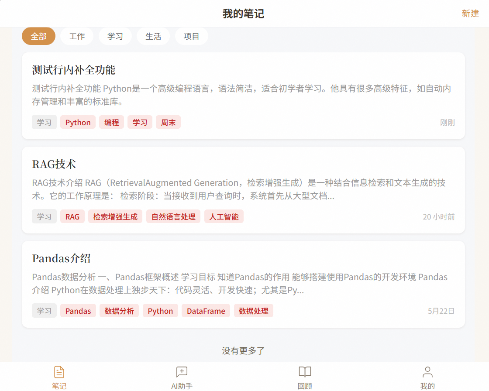
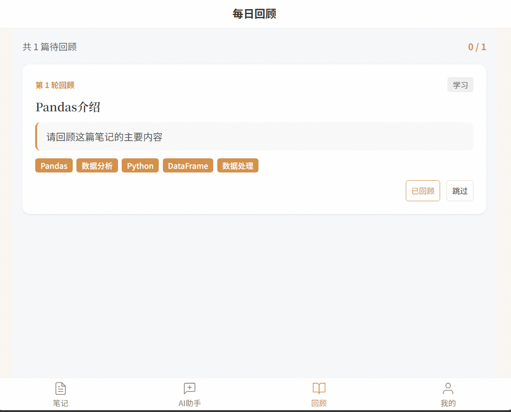
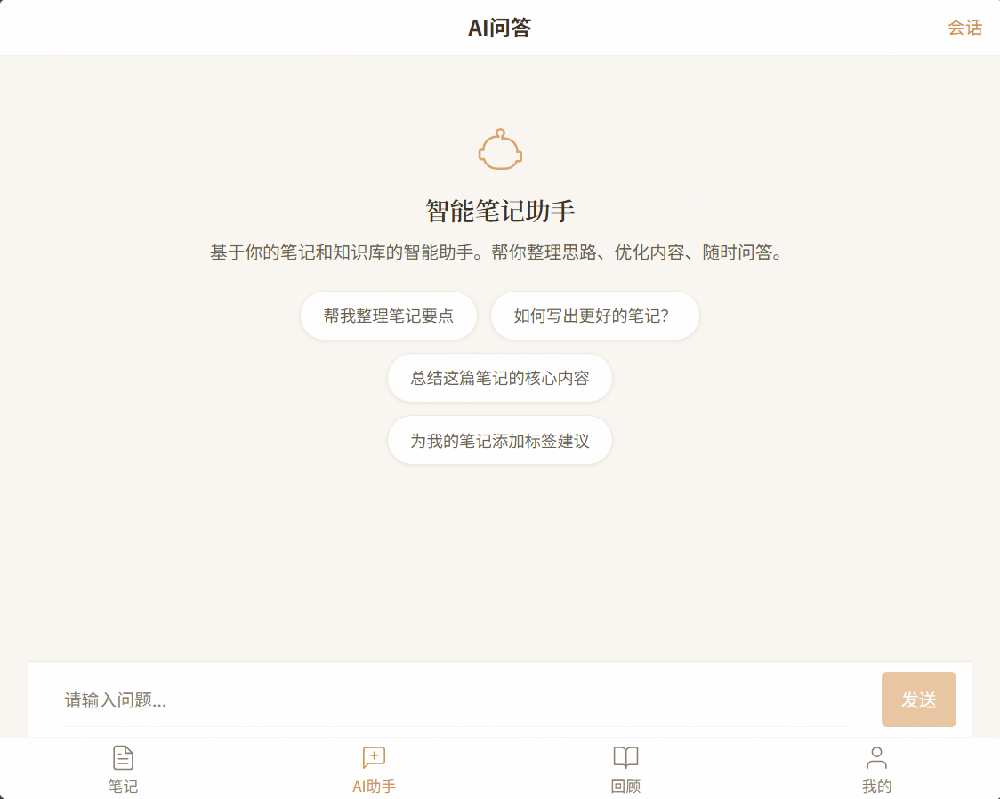
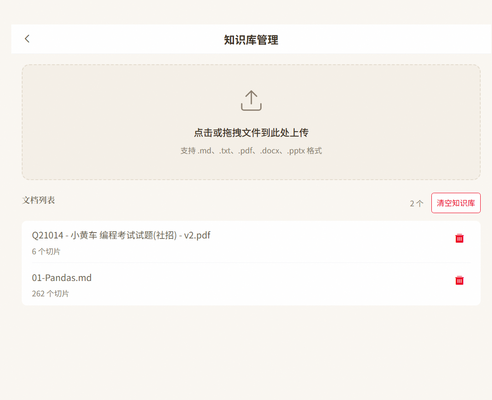
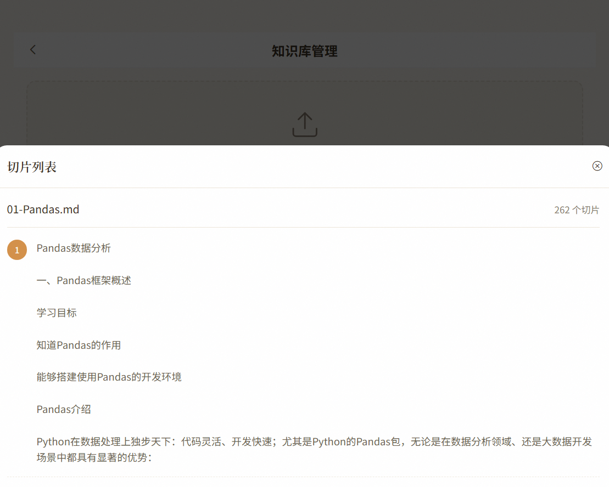
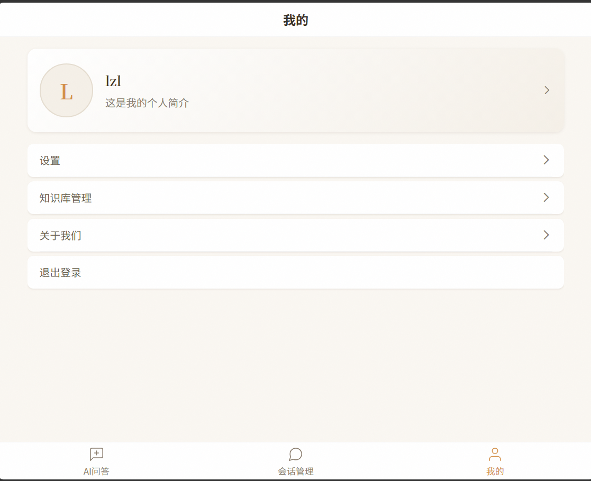

# AI智能笔记助手 AI-Smart-Note-Assistant

<div align="center">
<a href="https://github.com/Saber-YangZi/AI-Smart-Note-Assistant/stargazers">
  
</a>
<a href="https://github.com/Saber-YangZi/AI-Smart-Note-Assistant/network/members">
  
</a>
<a href="https://github.com/Saber-YangZi/AI-Smart-Note-Assistant/issues">
  
</a>
<br>


</div>

AI 驱动的个人知识管理工具，融合 **笔记管理 + RAG 知识库 + AI 写作辅助**，解决"笔记写了从不回看、知识散落成孤岛"的问题。

---

## 📋 目录

- [项目简介](#项目简介)
- [核心特性](#核心特性)
- [项目架构](#项目架构)
- [项目演示](#项目演示)
- [快速开始](#快速开始)
- [技术栈](#技术栈)
- [项目结构](#项目结构)
- [API 文档](#api文档)
- [配置说明](#配置说明)
- [部署指南](#部署指南)
- [故障排除](#故障排除)
- [贡献指南](#贡献指南)
- [许可证](#许可证)

## 项目简介

基于 **FastAPI + LangChain + Vue 3** 构建的智能笔记助手，核心能力包括：

- **笔记管理**：Markdown 编辑器、智能标签（LLM 自动分类）、语义搜索、Markdown 导出
- **RAG 知识库**：多格式文档上传（txt/pdf/md/pptx/docx），基于向量检索的精准问答
- **间隔重复回顾**：艾宾浩斯遗忘曲线算法，对抗遗忘
- **AI 写作辅助**：联机补全、续写/扩写/摘要、关联笔记推荐

系统支持会话持久化（MySQL）、向量检索（ChromaDB）、JWT 用户隔离，前端采用 Vue 3 + Vant 4 移动端友好的界面。

## 核心特性

| 特性 | 描述 |
|------|------|
| 📝 **笔记管理** | Markdown 编辑器（bytemd），支持新建、编辑、删除、分类筛选、分页列表 |
| 🏷️ **智能标签** | 保存笔记后 LLM 异步生成标签和分类（工作/学习/生活/项目），无需手动归类 |
| 🔍 **语义搜索** | 基于向量嵌入的笔记全文搜索，告别关键词匹配 |
| 🔄 **间隔重复回顾** | 艾宾浩斯遗忘曲线（1/2/4/7/15/30 天），每日提醒需要回顾的内容 |
| ✍️ **AI 联机补全** | 打字停顿后模型实时补全，Tab 键快速采纳 |
| 🤖 **AI 写作助手** | 续写、扩写、摘要生成，SSE 流式输出 |
| 🔗 **跨源关联推荐** | 编辑笔记时，从笔记库和知识库双向检索 Top k 相关文档 |
| 💬 **智能问答** | 基于 RAG 技术的 Agent 对话，支持文档引用来源展示 |
| 💾 **会话持久化** | MySQL 存储对话历史，随时回溯 |
| 📄 **文档管理** | 支持 TXT / PDF / MD / PPTX / DOCX 上传，可视化切片详情 |
| 🌐 **多语言支持** | 前端 i18n，中英文界面切换 |
| ⛑️ **安全隔离** | 用户级知识库隔离，RAG 检索只能访问本人数据 |

## 项目架构

```
┌─────────────────────────────────────────────────────────────┐
│                      前端 (Vue 3)                          │
│  ┌─────────┐ ┌─────────┐ ┌─────────┐ ┌─────────┐         │
│  │笔记管理 │ │AI聊天   │ │知识库   │ │每日回顾 │         │
│  └────┬────┘ └────┬────┘ └────┬────┘ └────┬────┘         │
└───────┼───────────┼───────────┼───────────┼───────────────┘
        │           │           │           │
        ▼           ▼           ▼           ▼
┌─────────────────────────────────────────────────────────────┐
│                    Vite 代理 (端口 3000)                    │
└───────┬───────────┬───────────┬───────────┼───────────────┘
        │           │           │           │
        ▼           ▼           ▼           ▼
┌───────────────────────────┬───────────────────────────────┐
│     FastAPI 后端 (8000)    │      Django 用户服务 (8001)    │
│  ┌─────────────────────┐  │  ┌─────────────────────┐     │
│  │ RAG 检索引擎        │  │  │ 用户注册/登录        │     │
│  │ Agent 对话系统      │  │  │ JWT 认证            │     │
│  │ 笔记服务            │  │  │ 文件上传            │     │
│  │ 回顾服务            │  │  │                     │     │
│  └─────────────────────┘  │  └─────────────────────┘     │
└───────────┬───────────────┴────────────┬───────────────────┘
            │                            │
            ▼                            ▼
┌─────────────────────┐      ┌─────────────────────┐
│   ChromaDB (向量)   │      │      MySQL          │
│   Redis (缓存)      │      │   (用户/笔记/聊天)   │
└─────────────────────┘      └─────────────────────┘
```

## 项目演示

| 功能模块 | 界面展示 | 功能说明 |
|---------|:--------|---------|
| 📒 笔记编辑 |  | 在线 Markdown 编辑器，支持行内 AI 补全、相关笔记推荐 |
| 📝 笔记列表 |  | 笔记列表，自动分类、打标签 |
| 🔄 每日回顾 |  | 艾宾浩斯遗忘曲线算法，每日提醒需要回顾的内容 |
| 💬 AI 聊天 |  | RAG 智能问答，支持上下文对话和文档引用 |
| 📚 知识库 |  | 多格式文档上传和管理 |
| ✂️ 文档切片 |  | 可视化文档切片详情 |
| 👤 用户服务 |  | 用户登录、注册、个人信息管理 |

## 快速开始

### 环境要求

| 环境 | 版本推荐 |
|------|----------|
| Python | 3.12+ |
| Node.js | 16+ |
| MySQL | 5.7+ / 8.0+ |
| Redis | 6.0+ |

### 克隆项目

```bash
git clone https://github.com/Saber-YangZi/AI-Smart-Note-Assistant.git
cd AI-Smart-Note-Assistant
```

### 安装依赖

#### 后端依赖

```bash
cd backend
python -m venv .venv
# Windows PowerShell
.venv\Scripts\Activate.ps1
# Linux/Mac
source .venv/bin/activate
pip install -r requirements.txt
```

#### 前端依赖

```bash
cd front
npm install
# 或使用 pnpm
pnpm install
```

#### 用户服务依赖

```bash
cd DjangoUserService
python -m venv .venv
# Windows PowerShell
.venv\Scripts\Activate.ps1
# Linux/Mac
source .venv/bin/activate
pip install -e .
```

### 环境配置

#### 创建后端环境变量文件

在 `backend` 目录下创建 `.env` 文件：

```env
# ==================== LLM 大模型配置 ====================
# LLM类型：ALIYUN | OLLAMA
LLM_TYPE=OLLAMA

# ==================== Ollama 配置 (LLM_TYPE=OLLAMA) ====================
OLLAMA_BASE_URL=http://localhost:11434
OLLAMA_MODEL_NAME=qwen2.5:7b

# ==================== 阿里云百炼配置 (LLM_TYPE=ALIYUN) ====================
ALIYUN_ACCESS_KEY_SECRET=your_aliyun_api_key
ALIYUN_BASE_URL=https://dashscope.aliyuncs.com/compatible-mode/v1
CHAT_MODEL_NAME=qwen3-max

# ==================== 向量嵌入模型配置 ====================
EMBED_MODEL_TYPE=OLLAMA
TEXT_EMBEDDING_MODEL_NAME=qwen3-embedding:0.6b
ALIYUN_EMBED_MODEL_NAME=text-embedding-v4

# ==================== 多模态视觉模型配置 ====================
VISION_MODEL_TYPE=OLLAMA
VISION_CHAT_MODEL_NAME=qwen-vl-max
VISION_OLLAMA_MODEL_NAME=qwen-vl:7b

# ==================== 重排序模型配置 ====================
RERANKER_MODEL_PATH=./models/Qwen3-Reranker-0.6B

# ==================== 数据库配置 ====================
MYSQL_USER=root
MYSQL_PASSWORD=your_mysql_password
MYSQL_HOST=127.0.0.1
MYSQL_PORT=3306
MYSQL_DATABASE=chat_history

REDIS_HOST=127.0.0.1
REDIS_PORT=6379
REDIS_DB=0

# ==================== 服务配置 ====================
DJANGO_API_URL=http://127.0.0.1:8001

# ==================== LangSmith 调试追踪 (可选) ====================
LANGCHAIN_TRACING_V2=false
LANGCHAIN_API_KEY=your_langsmith_api_key
LANGCHAIN_PROJECT=your_project_name

# ==================== JWT 身份验证配置 ====================
SECRET_KEY=your_jwt_secret_key
ALGORITHM=HS256
```

#### 创建用户服务环境变量文件

在 `DjangoUserService` 目录下创建 `.env` 文件：

```env
# 环境标识：dev(开发) / prod(生产)
ENV=dev

# JWT 配置
JWT_SECRET_KEY=your_jwt_secret_key

# 数据库配置
DB_PORT=3306
DB_NAME=user_service
DB_USER=root
DB_PASSWORD=your_mysql_password
DB_HOST=127.0.0.1

# Celery 配置
CELERY_BROKER_URL=redis://localhost:6379/0
CELERY_RESULT_BACKEND=redis://localhost:6379/0
CELERY_TASK_TIME_LIMIT=300
CELERY_TASK_SOFT_TIME_LIMIT=250
CELERY_RESULT_EXPIRES=3600

# Redis 配置
REDIS_CACHE_URL=redis://localhost:6379/1
```

配置好 env 文件后，执行 Django ORM 迁移：

```bash
cd DjangoUserService
python manage.py makemigrations
python manage.py migrate
```

### 启动服务

| 服务 | 命令 | 端口 |
|------|------|------|
| 后端服务 | `cd backend && python -m uvicorn main:app --reload` | 8000 |
| 前端服务 | `cd front && npm run dev` | 3000 |
| 用户服务 | `cd DjangoUserService && python manage.py runserver 8001` | 8001 |
| MySQL | `net start mysql`（Windows）/ `systemctl start mysql`（Linux） | 3306 |
| Redis | `net start redis`（Windows）/ `systemctl start redis`（Linux） | 6379 |
| Ollama | `ollama serve` | 11434 |

### 访问地址

- 前端界面：http://localhost:3000
- 后端 API 文档：http://localhost:8000/docs
- 用户服务 API 文档：http://localhost:8001/docs/

## 技术栈

### 后端技术

| 技术 | 版本 | 说明 |
|------|------|------|
| FastAPI | 0.123+ | 高性能异步 Web 框架 |
| LangChain | 1.2+ | 大语言模型应用开发框架（AgentExecutor + Tools） |
| ChromaDB | 1.5+ | 轻量级向量数据库 |
| SQLAlchemy | 2.0+ | 异步 ORM，管理 MySQL |
| Django | 5.2+ | 用户认证和管理系统 |
| MySQL | 5.7+ | 关系型数据库（chat_history / notes / reviews） |
| Redis | 6.0+ | 缓存 |
| DashScope API | - | 大语言模型服务（Qwen3-Max） |
| Ollama | 0.6+ | 本地模型部署（qwen2.5:7b） |
| Hugging Face | - | 重排序模型（Qwen3-Reranker-0.6B） |
| Sentence-Transformers | 5.5+ | 句子嵌入模型 |

### 前端技术

| 技术 | 版本 | 说明 |
|------|------|------|
| Vue 3 | 3.x | 现代化前端框架（Composition API） |
| Vite | 7.x | 极速构建工具 |
| Vant 4 | 4.9+ | 移动端 UI 组件库 |
| bytemd | 1.22+ | Markdown 编辑器 |
| Vue Router | 4.5+ | 路由管理 |
| Pinia | 3.0+ | 状态管理 |
| Vue i18n | 9.8+ | 国际化（中/英） |
| Axios | 1.12+ | HTTP 客户端 |
| highlight.js | 11.11+ | 代码语法高亮 |
| dompurify | 3.2+ | HTML 安全过滤 |

## 项目结构

```
AI-Smart-Note-Assistant/
├── backend/                     # FastAPI 后端服务
│   ├── app/
│   │   ├── agent/               # Agent 智能代理模块
│   │   │   ├── agent.py         # AgentFactory + Tool 定义
│   │   │   ├── agent_middleware.py
│   │   │   └── agent_tools.py
│   │   ├── config/              # 配置文件（chroma.yaml 等）
│   │   ├── core/                # 核心工具（限流、响应封装、日志）
│   │   ├── db/                  # 数据库配置（MySQL + Redis）
│   │   ├── models/              # SQLAlchemy ORM 模型
│   │   │   ├── note.py          # 笔记模型
│   │   │   ├── review_record.py # 回顾记录模型
│   │   │   └── chat_history.py  # 对话历史模型
│   │   ├── prompt/              # 提示词模板
│   │   ├── rag/                 # RAG 核心功能
│   │   │   ├── rag_service.py   # RAG 服务（HyDE + 混合检索）
│   │   │   ├── reorder_service.py
│   │   │   ├── vector_store.py  # ChromaDB 封装
│   │   │   ├── text_spliter.py  # 文档切片
│   │   │   ├── document_handler/# 文档解析（txt/pdf/md/pptx/docx）
│   │   │   ├── retrievers/      # 自定义检索器
│   │   │   └── task_queue.py    # 后台处理队列
│   │   ├── router/              # API 路由
│   │   │   ├── chat.py          # 聊天 & Agent 路由
│   │   │   ├── note_router.py   # 笔记 CRUD & AI 路由
│   │   │   ├── review_router.py # 间隔重复回顾路由
│   │   │   ├── knowledge_router.py
│   │   │   ├── user.py
│   │   │   └── health.py
│   │   ├── schemas/             # Pydantic 数据模型
│   │   ├── services/            # 业务服务层
│   │   │   ├── note_service.py  # 笔记服务（CRUD + 向量化 + AI 写作）
│   │   │   └── review_service.py# 回顾服务（艾宾浩斯算法）
│   │   └── utils/               # 工具函数
│   ├── data/                    # 数据存储目录
│   ├── main.py                  # 应用入口
│   ├── pyproject.toml
│   └── requirements.txt
├── front/                       # Vue 3 前端项目
│   ├── src/
│   │   ├── components/          # 通用组件
│   │   │   ├── MarkdownEditor.vue   # bytemd 封装
│   │   │   ├── RelatedNotes.vue     # 关联笔记侧边栏
│   │   │   ├── InlineCompletion.vue # AI 联机补全
│   │   │   ├── ReviewCard.vue       # 回顾卡片
│   │   │   ├── TagBadge.vue         # 标签徽章
│   │   │   ├── TabBar.vue           # 底部导航
│   │   │   └── QuickToolbar.vue     # 快捷工具栏
│   │   ├── views/              # 页面视图
│   │   │   ├── NoteEditor.vue       # 笔记编辑器
│   │   │   ├── NoteList.vue         # 笔记列表
│   │   │   ├── DailyReview.vue      # 每日回顾
│   │   │   ├── AIChat.vue           # AI 聊天
│   │   │   ├── Sessions.vue         # 会话管理
│   │   │   ├── KnowledgeBase.vue    # 知识库管理
│   │   │   ├── Login.vue / Register.vue
│   │   │   ├── My.vue / Profile.vue / Settings.vue
│   │   │   └── AboutUs.vue
│   │   ├── router/index.js     # 路由配置
│   │   ├── store/              # Pinia 状态管理
│   │   ├── i18n/               # 国际化（中/英）
│   │   └── config/api.js       # API 地址配置
│   ├── index.html
│   ├── package.json
│   └── vite.config.js
├── DjangoUserService/           # Django 用户服务
│   ├── apps/
│   │   ├── user/               # 用户注册/登录/认证
│   │   ├── file/               # 头像上传
│   │   └── utils/              # 工具函数
│   ├── manage.py
│   ├── pyproject.toml
│   └── api.md                  # 用户服务 API 文档
├── docs/                        # 项目文档
│   ├── modelscope_model.md     # 模型下载和配置
│   ├── project_develop.md      # 项目开发历程
│   └── troubleshooting.md      # 故障排除
├── images/                      # 截图资源
├── .gitignore
└── README.md
```

## API 文档

### FastAPI 后端 API

- 完整的 OpenAPI 规范文件：[backend/openapi.json](./backend/openapi.json)
- 启动服务后访问交互式文档：[http://localhost:8000/docs](http://localhost:8000/docs)

### Django 用户服务 API

- 详细文档：[DjangoUserService/api.md](./DjangoUserService/api.md)
- 交互式文档（启动后）：[http://localhost:8001/docs/](http://localhost:8001/docs/)

## 配置说明

### LLM 模型切换

系统支持 **阿里云百炼（DashScope）** 和 **Ollama（本地部署）** 两种模式：

- **LLM_TYPE=ALIYUN**：使用 Qwen3-Max 大模型 + text-embedding-v4 嵌入
- **LLM_TYPE=OLLAMA**：使用本地 Ollama 模型（推荐开发测试使用）

### 重排序模型

下载 Qwen3-Reranker-0.6B 模型并配置 `RERANKER_MODEL_PATH` 路径，参考 [模型配置指南](./docs/modelscope_model.md)。

### 前端代理配置

前端通过 Vite 代理转发 API 请求：

```javascript
// front/vite.config.js
proxy: {
  '/knowledge/': { target: 'http://127.0.0.1:8000', changeOrigin: true },
  '/chat/': { target: 'http://127.0.0.1:8000', changeOrigin: true, ws: true },
  '/note/': { target: 'http://127.0.0.1:8000', changeOrigin: true },
  '/review/': { target: 'http://127.0.0.1:8000', changeOrigin: true },
  '/user': { target: 'http://127.0.0.1:8001', changeOrigin: true },
  '/file': { target: 'http://127.0.0.1:8001', changeOrigin: true },
}
```

## 部署指南

### Docker 部署（推荐）

```bash
# 构建并启动所有服务
docker-compose up -d
```

### 手动部署

1. **安装依赖**：按照快速开始中的步骤安装所有依赖
2. **配置环境变量**：创建 `.env` 文件并填写配置
3. **启动服务**：依次启动 MySQL、Redis、用户服务、后端服务、前端服务

## 故障排除

详细的故障排除指南请参考：[故障排除](./docs/troubleshooting.md)

常见问题：

| 问题 | 解决方案 |
|------|----------|
| API Key 错误 | 检查 `ALIYUN_ACCESS_KEY_SECRET` 是否正确配置 |
| 数据库连接失败 | 确认 MySQL / Redis 服务已启动，配置信息正确 |
| ChromaDB 异常 | 检查 `chroma.yaml` 中的路径配置，确保目录存在 |
| 重排序模型加载失败 | 确认 `RERANKER_MODEL_PATH` 指向正确的模型路径 |
| Ollama 连接失败 | 确认 `ollama serve` 已运行且模型已拉取 |
| 前端跨域问题 | 确认 Vite 代理配置正确，后端 CORS 已启用 |
| 端口占用 | 修改 `vite.config.js`、`main.py`、`manage.py` 中的端口配置 |

## 贡献指南

欢迎贡献代码！请遵循以下流程：

1. Fork 仓库
2. 创建功能分支：`git checkout -b feature/your-feature`
3. 提交更改：`git commit -m "Add your feature"`
4. 推送到分支：`git push origin feature/your-feature`
5. 创建 Pull Request

## 许可证

本项目采用 MIT 许可证，详见 [LICENSE](./LICENSE) 文件。

## Star History

<picture>
  <source media="(prefers-color-scheme: dark)" srcset="https://api.star-history.com/chart?repos=Saber-YangZi/AI-Smart-Note-Assistant&type=date&theme=dark&legend=top-left" />
  <source media="(prefers-color-scheme: light)" srcset="https://api.star-history.com/chart?repos=Saber-YangZi/AI-Smart-Note-Assistant&type=date&legend=top-left" />
  
</picture>

---

**AI智能笔记助手** - 让AI帮你管理知识，让学习更高效 🚀
